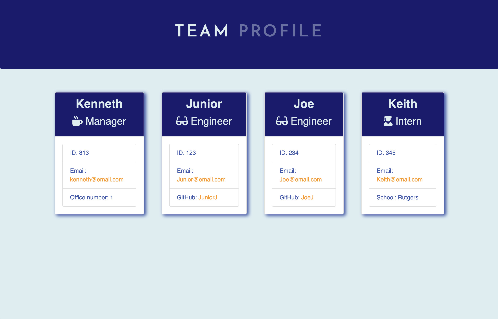

# Team-Profile-Generator


## Table of Contents
* [Description](#description)
* [Demo](#demo)
* [Program Installation](#program-installation)
* [Program Usage](#program-usage)
* [Technologies](#technologies)
* [Links](#links)
* [Contribution](#contribution)
* [Questions](#questions)
* [License](#license)

## Description
The purpose of this application is to allow users to create a Team Profile.\
Upon first loading the program, the end-user is prompted to input information.\
Once all the information has been filed out, an HTML file is generated for the user.

## Demo


## Program Installation
To use this program we will need to install Node.js\
Please use the link below to download a suitable version for your OS:

[Node.js Downloads](https://nodejs.org/en/download/)

Once installed we can use your command-line interface\
(Git/Terminal - MacOS, Linux & Ubuntu, CMD/Git - Windows)\
to run browse to the main repository, then run the following command:

```bash
npm install
```

The package.json will install the necessary dependencies for the program to run.

## Program Usage
After using the program installation instructions, we can then start using the program\
Remaining in the terminal, we can use the following command to run the application:

```bash
npm run start
```

The program will then initialize and function as shown in the demo.

## Technologies
- [BootStrap](https://getbootstrap.com/){:target="_blank"}
- [CSS](https://developer.mozilla.org/en-US/docs/Web/CSS)
- [Google Fonts](https://fonts.google.com/)
- [HTML](https://developer.mozilla.org/en-US/docs/Web/HTML)
- [Javascript](https://www.javascript.com/)
- [Node.js](https://nodejs.org/en/about/)

## Links
- [Github Repository URL](https://github.com/Kpetiote/Team-Profile-Generator)
- [Video Presentation](https://drive.google.com/file/d/1SAcQTJrscyF_YLz9u09Khf9tyLSEIu5F/view?usp=sharing)

## Contribution
None

## Questions
Please feel free to contact me with any questions:
- [Email](mailto:kenneth.petiote@gmail.com)
- [Github](https://github.com/Kpetiote)

## License

<br />
Licensed under the MIT License license. 